# 🌊 FloatChat - Complete Project Architecture

> **AI-Powered Conversational Interface for ARGO Ocean Data Analysis**  
> Ministry of Earth Sciences | INCOIS

---

## 📋 Table of Contents

1. [System Overview](#-system-overview)
2. [Architecture Diagram](#-architecture-diagram)
3. [Component Breakdown](#-component-breakdown)
4. [Execution Flow](#-execution-flow)
5. [MCP Tool System](#-mcp-tool-system)
6. [Data Flow Pipeline](#-data-flow-pipeline)
7. [Technology Stack](#-technology-stack)

---

## 🎯 System Overview

FloatChat is an intelligent conversational interface that enables users to query, analyze, and visualize **1.27 million ARGO ocean float records** using natural language. It combines **RAG (Retrieval-Augmented Generation)**, **MCP (Model Context Protocol)**, and **Vector Search** to provide accurate, context-aware responses.

### Key Features
- 🤖 Natural language queries (no SQL knowledge needed)
- 🗺️ Interactive map visualizations
- 📊 Real-time data analytics
- 🔍 Semantic profile search (FAISS vector store)
- 💬 Context-aware conversation memory
- 🛠️ 9 specialized MCP tools for data operations

---

## 🏗️ Architecture Diagram

### High-Level System Architecture

```mermaid
graph TB
    subgraph "Frontend Layer"
        UI[Streamlit UI<br/>🖥️ Web Interface]
        TABS[Tab System<br/>📑 Dashboard / Map / Analytics / Chat]
    end
    
    subgraph "Application Layer"
        APP[Main App<br/>app.py<br/>🎯 Entry Point]
        INTENT[Intent Classifier<br/>🧠 Groq Llama 3.3<br/>Route: Data vs Conversational]
        MCP_CHAT[MCP Chat Interface<br/>💬 Query Handler]
    end
    
    subgraph "MCP Tool Layer"
        MCP_PROCESSOR[MCP Query Processor<br/>🔧 Tool Orchestrator]
        MCP_SERVER[ARGO MCP Server<br/>🛠️ 9 Tools Registered]
        
        subgraph "MCP Tools"
            T1[query_argo_data]
            T2[get_database_schema]
            T3[search_similar_profiles]
            T4[compare_regions]
            T5[identify_water_masses]
            T6[calculate_thermocline]
            T7[get_temporal_trends]
            T8[calculate_mld]
            T9[analyze_profile_statistics]
        end
    end
    
    subgraph "RAG Pipeline Layer"
        QP[Query Processor<br/>🔄 Orchestrates Pipeline]
        VS[Vector Store<br/>🔍 FAISS<br/>1,306 Embeddings]
        SQLGEN[SQL Generator<br/>🔧 Groq Llama 3.3<br/>NL → SQL]
        RG[Response Generator<br/>📝 Groq Llama 3.3<br/>Format Results]
    end
    
    subgraph "Data Layer"
        DB[(PostgreSQL<br/>Neon Cloud<br/>💾 1.27M Records)]
        SCHEMA[Database Schema<br/>argo_profiles<br/>profile_summaries]
    end
    
    subgraph "AI Models"
        GROQ[Groq API<br/>Llama 3.3 70B<br/>All LLM Tasks]
        EMBED[Embeddings<br/>all-MiniLM-L6-v2<br/>384 dimensions]
    end
    
    UI --> APP
    APP --> INTENT
    INTENT -->|Data Query| MCP_CHAT
    INTENT -->|Conversational| MCP_CHAT
    MCP_CHAT --> MCP_PROCESSOR
    MCP_PROCESSOR --> MCP_SERVER
    MCP_SERVER --> T1 & T2 & T3 & T4 & T5 & T6 & T7 & T8 & T9
    
    T1 & T3 & T4 & T5 & T6 & T7 & T8 & T9 --> QP
    T2 --> DB
    
    QP --> VS
    QP --> SQLGEN
    QP --> DB
    QP --> RG
    
    SQLGEN --> GROQ
    VS --> EMBED
    RG --> GROQ
    INTENT --> GROQ
    
    DB --> SCHEMA
    APP --> TABS
    TABS --> UI
    
    style UI fill:#667eea,stroke:#333,stroke-width:2px,color:#fff
    style MCP_SERVER fill:#f093fb,stroke:#333,stroke-width:2px,color:#000
    style QP fill:#4facfe,stroke:#333,stroke-width:2px,color:#fff
    style DB fill:#43e97b,stroke:#333,stroke-width:2px,color:#000
    style GROQ fill:#feca57,stroke:#333,stroke-width:2px,color:#000
```

---

## 🧩 Component Breakdown

### 1. Frontend Layer (`streamlit_app/`)

#### Main Application (`app.py`)
- **Purpose**: Entry point for the entire application
- **Responsibilities**:
  - Initialize Streamlit page configuration
  - Load custom CSS for modern UI
  - Render main header and navigation
  - Manage tab system (Dashboard, Map, Analytics, Chat, Data Table)
  - Coordinate component communication via session state

#### Components (`components/`)

| Component | File | Responsibility |
|-----------|------|----------------|
| **MCP Chat Interface** | `mcp_chat_interface.py` | Query input, conversation memory, response display |
| **Data Dashboard** | `data_dashboard.py` | Metrics cards, query-specific statistics |
| **Map View** | `map_view.py` | Interactive Leaflet map with float locations |
| **Advanced Viz Panel** | `advanced_viz_panel.py` | Plotly charts (profiles, trends, comparisons) |
| **Profile Viewer** | `profile_viewer.py` | Detailed profile analysis |
| **Sidebar** | `sidebar.py` | Filters, settings, about section |

---

### 2. Intent Classification System (`rag_engine/intent_classifier.py`)

#### Purpose
Routes queries to appropriate handlers based on user intent, making responses human-like and context-aware.

#### Supported Intents
1. **greeting** - "hi", "hello", "hey"
2. **thanks** - "thank you", "thanks"
3. **help** - "help me", "what can you do"
4. **developer_info** - "who built you"
5. **assistant_identity** - "who are you"
6. **about_floatchat** - "what is floatchat"
7. **data_query** - All oceanographic queries (default)

---

### 3. MCP Tool System

#### MCP Architecture

#### MCP Tool Details

| Tool Name | Purpose | Input | Output |
|-----------|---------|-------|--------|
| **query_argo_data** | General data queries | `query` (string), `limit` (int) | DataFrame with results |
| **get_database_schema** | Get DB structure | None | Schema + record counts |
| **search_similar_profiles** | Semantic search | `query_text`, `top_k` | Similar profiles |
| **compare_regions** | Regional comparison | `region1`, `region2`, `parameter` | Comparative stats |
| **identify_water_masses** | T-S diagram analysis | `min_depth`, `max_depth` | Water mass classification |
| **calculate_thermocline** | Find thermocline depth | `float_id`, `cycle` | Thermocline depth + gradient |
| **get_temporal_trends** | Time series analysis | `parameter`, `date_range` | Trend data |
| **calculate_mld** | Mixed layer depth | `float_id`, `cycle`, `criteria` | MLD value |
| **analyze_profile_statistics** | Profile summary | `float_id`, `cycle` | Detailed statistics |

---

### 4. RAG Pipeline

#### Complete RAG Flow

#### Pipeline Components

##### **Query Processor** (`rag_engine/query_processor.py`)
- Orchestrates the entire RAG pipeline
- Coordinates vector search, SQL generation, and execution
- Returns structured results with metadata

##### **Vector Store** (`vector_store/vector_db.py`)
- Technology: FAISS (Facebook AI Similarity Search)
- **1,306 profile embeddings** (384 dimensions)
- Embedding model: `sentence-transformers/all-MiniLM-L6-v2`
- Average search time: <100ms

##### **SQL Generator** (`rag_engine/sql_generator.py`)
- Powered by Groq Llama 3.3 70B
- Converts natural language → SQL queries
- Context-aware with retrieved profile summaries
- Validates SQL syntax before execution

##### **Response Generator** (`rag_engine/response_generator.py`)
- Formats query results into natural language
- Maintains conversational tone
- Includes relevant context and explanations

---

## 🔄 Complete Execution Flow

### End-to-End Query Processing

---

## 📊 Data Flow Pipeline

### Database to Visualization

---

## 💾 Database Schema

### Data Statistics

| Metric | Value |
|--------|-------|
| **Total Records** | 1,268,992 |
| **Unique Floats** | 668 |
| **Unique Profiles** | 1,306 |
| **Date Range** | 2004 - 2024 |
| **Geographic Coverage** | Indian Ocean |
| **Core ARGO Parameters** | Temperature, Salinity, Pressure |
| **BGC Parameters** | DO, Nitrate, pH, Chlorophyll, BBP, Irradiance |

---

## 🛠️ Technology Stack

### Frontend

### Backend & AI

### Database & Storage

### Complete Stack Table

| Category | Technology | Purpose |
|----------|-----------|---------|
| **Frontend** | Streamlit | Web UI framework |
| **Visualization** | Plotly, Leaflet | Charts and maps |
| **Database** | PostgreSQL (Neon) | Data storage |
| **Vector Store** | FAISS | Similarity search |
| **LLM (All Tasks)** | Groq Llama 3.3 70B | Intent, SQL, Responses |
| **Embeddings** | all-MiniLM-L6-v2 | Text embeddings |
| **ORM** | SQLAlchemy | Database operations |
| **Framework** | LangChain | RAG orchestration |
| **Monitoring** | LangSmith | Query tracing |
| **Data Processing** | Pandas, NumPy | Data manipulation |

---

## 🚀 Performance Metrics

### Query Processing Times

| Stage | Average Time | Description |
|-------|--------------|-------------|
| **Intent Classification** | 200ms | Groq API call |
| **Vector Search** | 100ms | FAISS similarity search |
| **SQL Generation** | 800ms | Groq API + validation |
| **Database Query** | 600ms | PostgreSQL execution |
| **Response Generation** | 500ms | Format results with Groq |
| **Visualization** | 300ms | Generate Plotly charts |
| **Total Pipeline** | **~2.5s** | End-to-end query |

---

## 📈 System Capabilities

### What FloatChat Can Do

---

## 🎓 Example Queries

### Supported Query Types

| Query Type | Example | MCP Tool Used |
|------------|---------|---------------|
| **General** | "Show me temperature data in Arabian Sea" | `query_argo_data` |
| **Schema** | "What data is available?" | `get_database_schema` |
| **Comparison** | "Compare salinity in Bay of Bengal vs Arabian Sea" | `compare_regions` |
| **Analysis** | "Find the thermocline for float 2902746" | `calculate_thermocline` |
| **Water Mass** | "Identify water masses between 100-500m" | `identify_water_masses` |
| **Trends** | "Show temperature trends over last 5 years" | `get_temporal_trends` |
| **Similarity** | "Find profiles similar to warm tropical water" | `search_similar_profiles` |
| **Statistics** | "Analyze profile statistics for float 1901740" | `analyze_profile_statistics` |

---

## 🔐 Security & Privacy

- ✅ No hardcoded API keys in code
- ✅ Environment variables for sensitive data
- ✅ `.gitignore` configured properly
- ✅ Secrets managed via Streamlit Cloud
- ✅ Database uses SSL connections
- ✅ Query logging for audit trails

---

| Metric | Count |
|--------|-------|
| **Total Lines of Code** | ~15,000 |
| **Python Files** | 45+ |
| **Components** | 12 |
| **MCP Tools** | 9 |
| **Database Tables** | 2 |
| **Vector Embeddings** | 1,306 |
| **Test Files** | 4 |

---

## 🎯 Key Innovations

1. **Hybrid RAG + MCP Architecture**
   - Combines retrieval-augmented generation with Model Context Protocol
   - Tool-based approach for specialized oceanographic operations

2. **Intent-Driven Routing**
   - Smart classification between conversational and data queries
   - Human-like responses for non-data questions

3. **Conversation Memory**
   - Maintains context across multiple turns
   - Understands follow-up queries ("tell me more", "elaborate")

4. **Synchronized Visualization**
   - All tabs update based on query context
   - Query-specific metrics (not entire database)

5. **Semantic Profile Search**
   - FAISS vector store for finding similar oceanographic profiles
   - Enables "find profiles like X" queries

---

## 📖 Documentation

- ✅ **README.md** - Project overview and features
- ✅ **DEPLOYMENT.md** - Complete deployment guide
- ✅ **SETUP_INSTRUCTIONS.md** - Local development setup
- ✅ **INTENT_CLASSIFICATION_GUIDE.md** - Intent system details
- ✅ **PERFORMANCE_OPTIMIZATION_GUIDE.md** - Performance tips
- ✅ **README_PROJECT_ARCHITECTURE.md** - This document

---

---

## 📞 Support

- **Documentation**: All `.md` files in root directory
- **Issues**: Check DEPLOYMENT.md troubleshooting section
- **Monitoring**: LangSmith dashboard for query traces

---

## 🏆 Achievements

- ✅ **1.27M records** migrated and queryable
- ✅ **2-3 second** average query response time
- ✅ **92% reduction** in documentation clutter
- ✅ **100%** test coverage for intent classification
- ✅ **Zero downtime** deployment on Streamlit Cloud

---

**Built with ❤️ by Abuzaid

---

*Last Updated: December 28, 2025*
